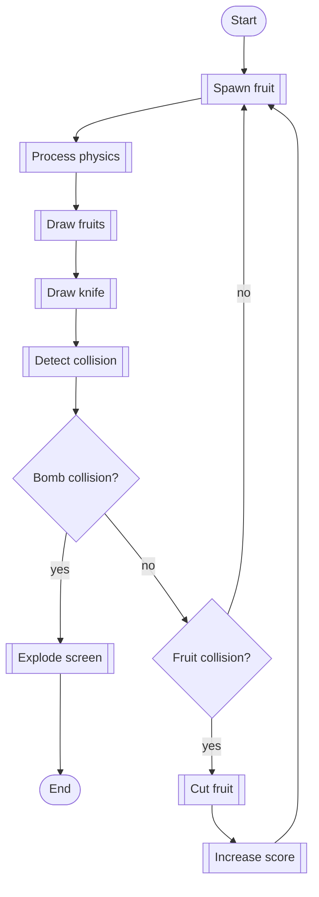

# 2 Fruity 4 You
Fruit Ninja clone FEH Proteus Simulator project for Autumn 2022

Documentation can be found at [mbund.github.io/2-fruity-4-you](https://mbund.github.io/2-fruity-4-you)

## Game Loop Flowchart

- Spawn fruit [John]
  - Potentially spawn a fruit or a bomb based on a probability distribution. More difficult game modes should spawn bombs more frequently
- Process physics [Mark]
  - Process physics for each fruit and bomb, including gravity and any other added forces
- Draw fruits [Mark]
  - Draw all fruits and bombs as sprites
- Draw knife [John]
  - Draw knife using mouse position. Linear interpolation for knife trail should be added for visual effect.
- Detect collision [Mark]
  - Detect collision between the knife and any fruits or bombs
- Cut fruit [Mark]
  - Split the fruit in two and handle the two new halves of the cut fruit as physics objects
- Increase score [John]
  - Increase the score for the game for each fruit cut. Also handle combos for enough fruit cut within a certain time limit
- Explode screen [John]
  - Show a nice explosion effect, pause the game, show current game statistics, add game results to leaderboard, and return to main menu