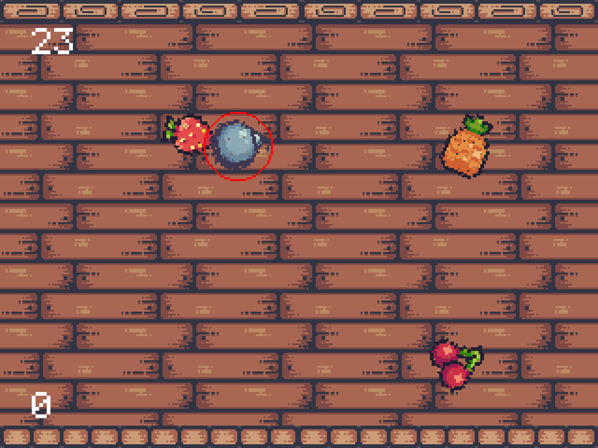

# 2 Fruity 4 You
Fruit Ninja clone FEH Proteus Simulator project for Autumn 2022.



## Documentation

Documentation can be found at [https://mbund.github.io/2-fruity-4-you](https://mbund.github.io/2-fruity-4-you).

## Running
The [latest binary releases can be found here](https://github.com/mbund/2-fruity-4-you/releases/latest) for x86_64 Ubuntu, x86_64 Windows, and x86_64 MacOS. [NixOS](#nixos) users can also easily run it.

## Building
Clone the repository (including submodules) and run make to build.

```
git clone https://github.com/mbund/2-fruity-4-you --recurse-submodules
```
```
make
```

[Doxygen](https://doxygen.nl) is used to create the documentation and may need to be installed as well.

## Dependencies

### Ubuntu
Install the required dependencies.

```
apt install pkg-config mesa-common-dev libopengl-dev
```

### Nix/OS
This repository is a flake and has a nix development shell available. You can also just run the game directly without cloning anything by running the following.
```
nix run github:mbund/2-fruity-4-you
```